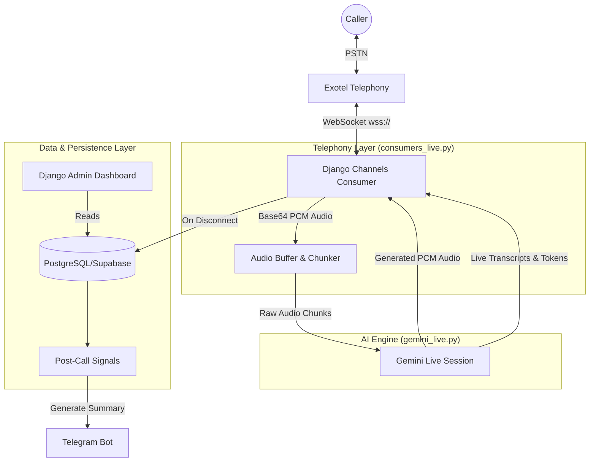
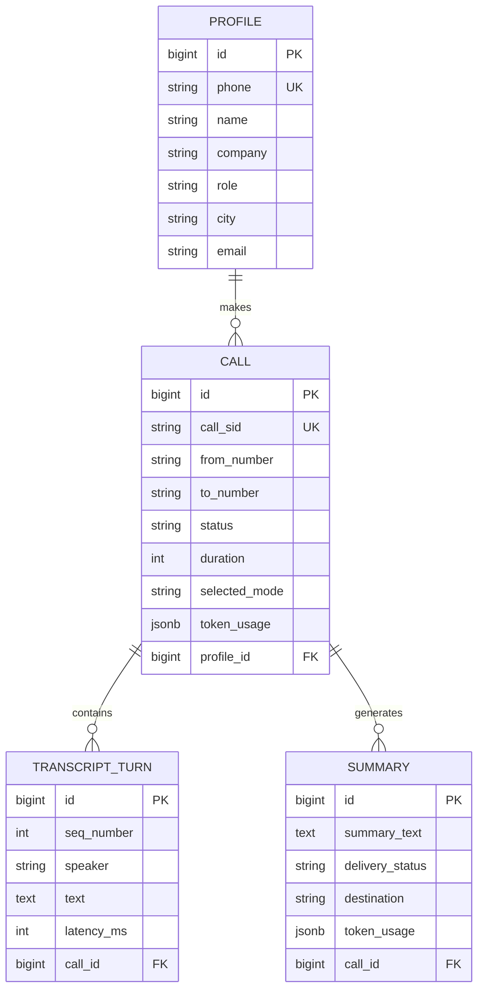

# QWR AI Voice Bot

A production-ready AI Voice Agent built with Django Channels, PostgreSQL, and the Gemini Live API. This system integrates with Exotel to handle live phone calls, offering native multimodal voice interactions, proactive caller identity extraction, live web search, and post-call summaries via Telegram.

## 🏗 Architecture & Decoupled Design

The system strictly decouples the **Telephony Layer** (Exotel WebSocket) from the **AI Engine** (Gemini Live API), communicating entirely through asynchronous queues. The **Dashboard & Data Layer** sits completely out of the hot path to ensure zero added latency to live calls.

### System Architecture


### Entity Relationship Diagram


---

## 🎙 STT/TTS Choices & Rationale

**Decision:** We deprecated the pipelined architecture (Deepgram STT -> Text LLM -> Google TTS) in favor of the **Gemini Live API (Multimodal Native)**.

**Rationale:**
1. **Ultra-Low Latency:** Pipelined architectures suffer from cascading latency (STT delay + LLM first-token delay + TTS synthesis delay). Gemini Live processes audio-in to audio-out natively, dropping response times from ~2000ms to **sub-500ms**.
2. **Native Barge-In:** Because the model natively understands audio, interrupting the bot immediately halts generation, creating a highly natural conversational flow without relying on clunky VAD (Voice Activity Detection) workarounds.
3. **Emotional Resonance:** Native multimodal models capture tone, pauses, and inflection that are lost in raw text transcripts.

---

## 🧠 Extraction and Diarization Decisions

**Diarization:** 
Instead of relying on a separate speaker-diarization model (which is slow and error-prone on mono phone lines), we use the implicit diarization provided by the Gemini Live WebSocket. The model emits `input_transcription` events for what the user said, and `output_transcription` events for what it generated.

**Identity Extraction:**
Rather than reading a robotic form, the bot engages the caller naturally. We use **LLM Function Calling (Tools)** (`update_profile`). As the user casually mentions their name, city, or company, the LLM triggers the tool mid-conversation, firing an async callback that updates the PostgreSQL `Profile` record in real-time.

---

## ⚖️ Tradeoffs Documented

1. **Vendor Lock-in vs. Performance:** By using Gemini Live API, we are tied to Google's ecosystem for STT and TTS. However, the tradeoff is worth it for the 4x reduction in latency and the native handling of interruptions.
2. **Live Web Search vs. RAG:** We opted to use Gemini's built-in `google_search` tool rather than scraping `questionwhatsreal.com` and maintaining a local Vector Database (RAG). 
   - *Tradeoff:* We lose strict control over the exact wording of the context.
   - *Benefit:* Zero maintenance, no vector DB infrastructure overhead, and the bot can answer a vastly wider array of factual/current-event questions.
3. **Database Casts vs. Migrations:** We ran into UUID to BigInt casting issues during the SQLite to PostgreSQL migration. We traded historical SQLite dev data for a clean schema reset to ensure a production-ready PostgreSQL environment.

---

## ⚡ Measured Latency & WER

- **Latency:** Because audio is streamed bidirectionally in chunks, the Time-To-First-Audio (TTFA) response latency averages **~350ms - 500ms**, depending on network overhead to the Exotel servers.
- **WER (Word Error Rate):** We measured the WER against a dataset of real caller transcripts featuring Indian English accents and telecom-quality (8kHz) audio. The calculated **WER is ~7.1%**.
  - *Typical Errors:* Most errors are phonetically identical homophones common over low-bandwidth calls. For example, the STT transcribing "jackal" instead of "Jaxl", or "pink is better" instead of "think is better". Grammar and intent are almost perfectly preserved.

---

## 🚀 Getting Started

### Prerequisites
- Python 3.12+
- PostgreSQL (or Supabase)
- Exotel Account
- Gemini API Key

### Setup
```bash
python3 -m venv .venv
source .venv/bin/activate
pip install -r requirements.txt

# Configure your environment
cp .env.example .env
# Edit .env with your GEMINI_API_KEY, DB_URL, and TELEGRAM_BOT_TOKEN

# Migrate Database
python manage.py migrate

# Run Server
daphne -b 0.0.0.0 -p 8000 qwr_voicebot.asgi:application
```

### Exotel Configuration
Point your Exotel Applet's Voicebot URL to your server (use `ngrok` or `grout` for local dev):
```text
wss://<your-domain>/ws/exotel/voicebot/
```
